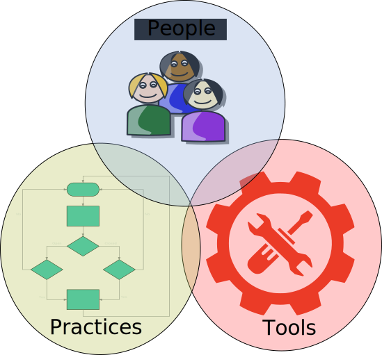
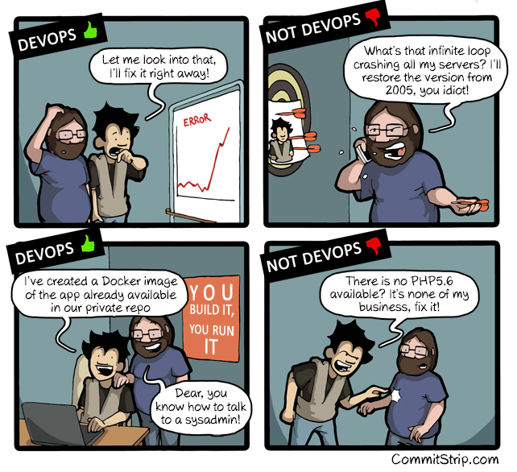

# Devops Intro

#### Quick Talk
_Rob Mason_

  
  

  (for my parts)

Note:
Introduce myself - systems engineer
worked in /developer/sys admin/manager roles
currently working with arch team in delivery

## The course is all in one slide

<!-- .slide: data-background-image="http://techbeacon.com/sites/default/files/UX-user-experience-lessons-learn-IT-phoenix-project-book-information-technology.jpg" -->
# Read This Book!
Note:
Novel - not text
About IT, Devops and winning in business
The three ways
It will provide a context - and it's a good read
Companies who put IT at the centre and see it as the differentiator

### Any Questions

## Traditional IT Practice

Note:
Starting point
Dev and Ops Separation

### Disadvantages
* 2 departments with different goals, skills, heartbeat, constraints
* Different environments between development and production - "it works for me!"
* Dev - " the code passed all tests, let's go!"
* Ops - "We had to work through the night to get it live"
* Ops on call for dev bugs/issues
* Local ops workarounds hinder onward development
* No awareness of impact of decisions on the other side
* Silos

## Silos
<figure>

<figcaption>

Silos - various Adrian Cockroft presentations

</figcaption>
</figure>

### Waste

# Enter DevOps

### Definitions of Devops

>"DevOps is the practice of operations and development engineers
>participating together in the entire service lifecycle, from design
>through the development process to production support"
[The Agile Admin](https://theagileadmin.com/what-is-devops/)

> "You build it, you run it!"
_Werner Vogels - Amazon_
Note:
Many similar definitions, I like the first
terse but to the point - Werner Vogels - Amazon CTO

<figure>

<figcaption>

The devops loop - various

</figcaption>
</figure>
Note:
Continuous Flow through the System

### "Lean" - where does Devops fit?

> "The core idea is to maximize customer value while minimizing waste. Simply, lean means creating more value for customers with fewer resources."

## Manufacturing Figured this Out

* Lean Manufacturing - Toyota Production System - AKA "Systems Thinking"
* Muda  - _"Eliminate the 7 wastes"_
* Kaizen - _"We improve our business operations continuously, always driving for innovation and evolution"_
* Genchi Genbutsu _"Continuously solving root problems drives organizational learning. Go to the source to find the facts to make correct decisions."_

### The Seven Wastes
<figure>

<figcaption>
 <a href="//commons.wikimedia.org/wiki/User:Alhmodeus" title="User:Alhmodeus">Alhmodeus</a> - Own work, <a href="http://creativecommons.org/licenses/by-sa/3.0" title="Creative Commons Attribution-Share Alike 3.0">CC BY-SA 3.0</a>, <a href="https://commons.wikimedia.org/w/index.php?curid=33766240">Link</a>

</figcaption>
</figure>
Note:
* Identified in manufacturing in the 80's
* Understand the whole process - left to right
* Understand how to balance and optimise the flow as a whole, sometimes optimising one silo can slow the end to end flow
* Systems thinking

### Kaizen
<figure>
  
  <figcaption>
    
    Image source: [TradeFax.net](http://www.tradefax.net/post/scm/20160223/kaizen__or_continuous_improvement__13.html)
    
  </figcaption>
</figure>

###Genchi Genbutsu
<figure>
  
  <figcaption>Image source: [Creating a Continuous Improvement Culture - The Karen Martin Group](http://www.slideshare.net/KarenMartinGroup/creating-a-continuous-improvement-culture-25218311)
  </figcaption>
</figure>

### Lean Software Development

* Mary Poppendieck
* Apply Lean manufacturing principles to software development

### Devops is Lean

* Extend lean principles to cover full software delivery, not just development

<!-- .slide: data-background-image="static/phoenix.png" -->
# So did I mention - Read this Book!?

<!-- .slide: data-background-image="static/phoenix.png" -->
# Learn the 3 Ways

### 1. Flow
* Understand how work moves through the system from left to right (dev to deployment)
* Systems Thinking - emphasise the performance of the whole system/organisation, not just specific silos
* Apply to any process large or small
  * Team can look at time from developer onboarding to productivity
  * Delivery manager can look at end to end flow of a software release

### 2. Feedback -
* Shorten and amplify feedback loops from right to left (from deployment back to dev)
* Fast identification of bugs and validation fixes
* Identify quickly if process change helps/hinders productivity

### 3. Experimentation and learning
* Culture of experimentation, risk taking and learning from failure
* Repetition is the path to mastery
* Don't defer the hard/complex stuff
  * Try it / Learn from failure
  * Iterate
Note:
The upgrading puppet master version anecdote

<iframe  width="854" height="480" src="https://www.youtube.com/embed/nUOXDEvplRc" frameborder="0" allowfullscreen></iframe>

### Theory of Constraints
* Set of management concepts to help identify:
  * What to change
  * What to change it to
  * How to cause the change
* Eli Goldratt - author if "The Goal" - the novel that inspired the Phoenix Project!

<iframe width="854" height="480" src="https://www.youtube.com/embed/qzhHNM5xWPQ" frameborder="0" allowfullscreen></iframe>

### Theory of Constraints

* Video provides simplistic view - manufacturing process is automated,repeatable
  * Can be characterised
* Sometimes in IT processes, people or external company factors involved => more variable
* It starts with metrics - no metrics => no identification of constraints
* Automation is key - automated processes more likely to give repeatable constraint

### Systems Thinking

> Systems thinking [is] a way of thinking about, and a language for describing and understanding, the forces and interrelationships that shape the behavior of systems. This discipline helps us to see how to change systems more effectively, and to act more in tune with the natural processes of the natural and economic world.
_Peter Senge - The Fifth Discipline_

**as distinct from event based thinking**

* System - set of interrelated and interdependent components that form a unified whole with specific purpose
* Collection != System
* Kitchen - a collection of things (albeit some of those things are systems, e.g. fridge)
* Bowl of fruit - a system - types of fruit in contact cause different decay effect
* Team - a system - people + character types + interactions

See [Introduction to Systems Thinking - Daniel Kim](https://thesystemsthinker.com/wp-content/uploads/2016/03/Introduction-to-Systems-Thinking-IMS013Epk.pdf)

### A Call to Action
######  Apply these small in your team, project _today_
######  Don't wait for the whole organisation to come round

### How to get there

Note:
Some people may also say People,Processes,Tools
I prefer practice as it suggests its an engrained thing, a process sounds like

<!-- .slide: data-background-image="static/devops_people.svg" -->
#People

.

.
Note:
refer back to the definition

<!-- .slide: data-background-image="static/devops_people.svg" -->
### (c)  [commitstrip.com](http://www.commitstrip.com/en/2015/02/02/is-your-company-ready-for-devops/)

<!-- .slide: data-background-image="static/devops_people.svg" -->
### (c) [commitstrip.com](http://www.commitstrip.com/en/2015/02/02/is-your-company-ready-for-devops/)

### Practices
|                              |                         |
| ---------------------------- |:-----------------------:|
| Small Batches                | Continuous Integration  |
| Integrated SCM               | Continuous Deployment   |
| Automated Testing            | Continuous Monitoring   |
| Infrastructure as Code       | Information Radiators   |
|                              |                         |

Note:
there are others

### Tools
* Devops practices are difficult to realise without the support of *tools*
* Good selection and application of tools is a critical success factor
* Using devops tools is not the same as implementing devops
* No specifically right answers - explosion of tools
* Always watch, review and improve toolchain

### People + Practices = Culture
<figure>
  
  <figcaption>
  
     Image (c) [martinfowler.com](http://www.martinfowler.com)
  
  </figcaption>
</figure>     

> "It is crucial to be open to change and have the correct internal
>environment to allow change to happen.
> This is not just in IT but throughout the business. This is why it is
>so important that devops has the correct senior backing and buy-in,
>otherwise it will fail."

_Gunnar Menzel - Chief Architect, Cap Gemeni_

## Note

* Devops culture characterised by freedom and responsibility - high trust environment
* Traditional IT culture characterised by bureaucracy and blame - low trust environment
*  **However that is not a license to "mess around" - apply "Theory of Constraints"**
* **"Responsibility" and "systems thinking" must inform actions and delivery**

### Section Summary

#### Devops
* Requires systems thinking view
* Requires Automation
* Values continuous collaboration
* Abhors silos
* Values speed
* Does more with less resources
* Values (reusable) tooling

## Practices

### A whistle-stop tour of practises

|                              |                         |
| ---------------------------- |:-----------------------:|
| Small Batches                | Continuous Integration  |
| Integrated SCM               | Continuous Deployment   |
| Automated Testing            | Continuous Monitoring   |
| Infrastructure as Code       | Information Radiators   |
|                              |                         |

### Automation

<!-- .slide: data-background-image="static/Ironic-Signage-photography-observations1.png" -->

Note:
* Sometimes in live we don't apply our knowledge to our own situations
...Which can lead to embarrassing results

<!-- .slide: data-background-image="static/Ironic-Signage-photography-observations.png" -->
### Computer programming is about:

* Automating repetitive tasks to make them more efficient
* Automating complex tasks so that they can be repeated without error

<!-- .slide: data-background-image="static/Ironic-Signage-photography-observations.png" -->
**"But somehow we didn't always automate our own processes - test, integration, deployment."**

_Me - just now_

## Manual Processes

* Slow
* Error prone
* Costly
* Can't be combined

### Small Batches
* Break work down into small chunks
* Commit, Test and Deliver often
* Small increments => problem source is easily identified
* Mapping of feature to performance improvement/degradation is obvious

### Integrated Version Control

### Automated Test

* TDD/Unit testing
* BDD/Acceptance Testing
* System/Performance  Testing
* Exploratory testing
* All must be automated to enable fast feedback, repeatability and ..._

_this will be covered elsewhere_
Note:
* System/performance can be related to theory of constraints
* Exploratory testing -good example of integrated teams - part of Kaizen, test hypothesis

### Continuous Integration

* Ensure health state of the codebase in a way that tracks the impact of
every code change
* Provide fast feedback to developers/teams of the impact their code
change has had on overall solution integrity
* Reduce risk in overall delivery
Note:
Anti pattern is to only see impact of change after it gets built into the system with lots of other things
Difficult and expensive to backtrack to root cause

<!-- .slide: data-background-image="static/salt.png" -->
### Infrastructure as code

> "The enabling idea of infrastructure as code is that systems and
> devices which are used to run software can be treated as if they,
> themselves, are software."
_[Keif Morris](https://www.thoughtworks.com/profiles/kief-morris)_
Note:
Same disciplines as any coding
version control, review, test,release

<!-- .slide: data-background-image="static/salt.png" -->
### Infrastructure as code
* Automation requires programability => APIs, even to the infrastructure
* Install the OS, configure the storage server, configure networking etc
* Maintain configuration
* Deliver Updates - different approaches
Note:
If ops code their infra they can work on providing "on demand services" instead of being reactive

<!-- .slide: data-background-image="static/salt.png" -->
##### Configuration Management
* Master is single source of configuration truth
* Agent synch with master periodically and re-applies config
* Prevents local login change breaking the service

<!-- .slide: data-background-image="static/salt.png" -->

##### Immutable Infrastructure/Phoenix Server
* Immutable - can re replaced but not modified
* Re-install/replace instance
* Frequent destroy/rebuild
* A working "image" is deployed
* Upgrade deploys a new working image
* On upgrade fail -> rollback to previous working image
* Avoid complex transition orchestration
* De-facto approach for cloud, but can be used with bare metal

<figure>

<figcaption>

Image source - boxfuse.com

</figaption>
</fig>

### Continuous Deployment

<!-- .slide: data-background-image="static/go-cd-pipeline-9227c98eca313a7b9f838e12daabf1f2.jpeg" -->   
### Has more complex workflows than CI
* Complex business processes, workflows and tool chains required
* Complex qualification tests - layers of integration
* Tends to be complex and brittle (if your delivery is complex and brittle)
#### *Alternatively*

<!-- .slide: data-background-image="static/go-cd-pipeline-9227c98eca313a7b9f838e12daabf1f2.jpeg" -->   
### Simplify
* Componentise with APIs
* API version negotiation
* Run each component in a container
* Each team continually deploys their service
* No complex inter-service  test flows

_AKA Microservices_

## Microservices
* Needs a talk in it's own right
* Good news - there's lots online

    **This one's good!** [The state of Microservices by Adrian Cockroft](https://www.youtube.com/watch?v=pwpxq9-uw_0)

* It is a huge contributor to successful realisation of devops goals
* We will take a peek

#### Small and Focussed
* Focus on a unit of work
* No formal sizing rules
  * Two pizza team rule
* Has it's own delivery pipeline
* Watch point is latency, services that are too small require a lot of interaction to deliver value

#### Loosely coupled
* Essential
* Can be developed/deployed without dependency on other services
* Zero co-ordination with other services for deployment
* Enables frequent & rapid deployment

#### Language Neutral
* Use correct tool for correct job
* Leverage skills available
* API is point of reference, implementation language is not

#### Bounded Context
* A specific microservice knows nothing about underlying implementation of any other microservice in the system
* Just API calls
* No need for knowledge of internals of other service otherwise it is not a bounded context

<figure>

<figcaption>
Image from <a href="http://www.kennybastani.com/2015/08/polyglot-persistence-spring-cloud-docker.html">http://www.kennybastani.com</a>

</figcaption>
</figure>

| Category          | Monolithic                                                | Microservices                                   |
|-------------------|----------------------------------------------------------------------------|----------------------------------------------------|
|Code               |A single code base for the entire application              | Multiple code bases. Each microservice has its own code base       |
|Understandability  |Often confusing and hard to maintain                       | Much better readability and much easier to maintain            |

| Category          | Monolithic                                           | Microservices                                               |
|-------------------|------------------------------------------------------|-------------------------------------------------------------|
|Deployment         |Complex - maintenance windows and scheduled downtimes | Simple - each microservice can be deployed individually     |
|Language           |Typically developed in one programming language       | Each microservice can be developed in a different  language |
|Scaling            |Scale the entire app when bottlenecks are localized   | Scale bottle-necked services without scaling the entire app |

###### Typically deployed in virtual machines or more recently containers

<!-- .slide: data-background-image="static/enterprise-hud.png" -->
### Continuous Monitoring

* Not just static alerting of failed states
* Continuous collection/querying of metrics data over time
* Continuous collection/query of logs
* Proactive monitoring -
  * "the system may be about to degrade"

<!-- .slide: data-background-image="static/Info-radiator-.png" -->
### Information Radiator
* Build state, tests passed/failed
* Work/task/project progress
* Everything is in the open/Nothing to hide
* Shared information for the business - everyone a stakeholder

## Tools & Technology

_Remember - tools will only serve once culture is in place, using devops tools does not automatically create a devops culture_

Note:
One reason for the increased adoption of DevOps is that (relatively)
recent tool types and technology deliverables increase the scope of
what is programmable

### Tool Selection
* Not necessarily as simple as "what's the best tool?"
* Fit to available skill set
* Fit to ecosystem
* Review and revise - there are always developments!

# Finally a high speed recap from Rackspace

<iframe width="854" height="480" src="https://www.youtube.com/embed/_I94-tJlovg" frameborder="0" allowfullscreen></iframe>

## Oh and did I Mention?

#### If you take only one thing away....

<!-- .slide: data-background-image="http://techbeacon.com/sites/default/files/UX-user-experience-lessons-learn-IT-phoenix-project-book-information-technology.jpg" -->

<!-- .slide: data-background-image="http://techbeacon.com/sites/default/files/UX-user-experience-lessons-learn-IT-phoenix-project-book-information-technology.jpg" -->
# Read This Book!

Note:
Devops arises from years of (bad) experience
For young 'uns starting out this presentation is just theory
Read the novel to understand how narrative is effected by these things
